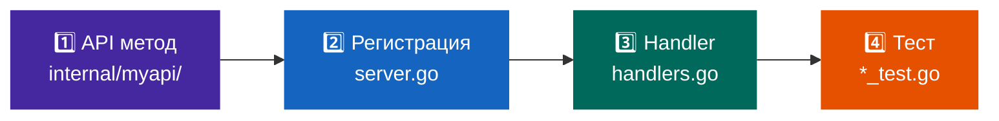

# Добавление инструментов

## 4 шага



Разберём на примере: добавляем `myapi_get_users`.

---

## Шаг 1: API метод

```go title="internal/myapi/users.go"
package myapi

import (
    "context"
    "fmt"
)

type User struct {
    ID       int    `json:"id"`
    Name     string `json:"name"`
    Email    string `json:"email"`
    Role     string `json:"role"`
    IsActive bool   `json:"is_active"`
}

type usersResponse struct {
    Users []User `json:"users"`
}

func (c *Client) GetUsers(ctx context.Context) ([]User, error) {
    var resp usersResponse
    if err := c.get(ctx, "/v1/users", nil, &resp); err != nil {
        return nil, fmt.Errorf("GetUsers: %w", err)
    }
    return resp.Users, nil
}

func (c *Client) GetUser(ctx context.Context, id string) (*User, error) {
    var resp struct {
        User User `json:"user"`
    }
    if err := c.get(ctx, "/v1/users/"+id, nil, &resp); err != nil {
        return nil, fmt.Errorf("GetUser %s: %w", id, err)
    }
    return &resp.User, nil
}
```

---

## Шаг 2: Регистрация

В `internal/mcp/server.go`, метод `buildToolRegistry()`:

```go
{
    Name: "myapi_get_users",
    Description: "Получить список всех пользователей системы. " +
        "Используй для поиска пользователей, просмотра ролей и статусов. " +
        "Возвращает id, name, email, role, is_active для каждого.",
    InputSchema: InputSchema{
        Type:       "object",
        Properties: map[string]Property{},  // нет параметров
    },
},
{
    Name: "myapi_get_user",
    Description: "Получить детальную информацию о конкретном пользователе. " +
        "Используй когда знаешь ID пользователя из myapi_get_users.",
    InputSchema: InputSchema{
        Type: "object",
        Properties: map[string]Property{
            "user_id": {
                Type:        "string",
                Description: "ID пользователя (числовой, напр. \"42\")",
            },
        },
        Required: []string{"user_id"},
    },
},
```

---

## Шаг 3: Handler

В `internal/mcp/handlers.go`:

```go
// Добавить case в executeTool()
case "myapi_get_users":
    return s.toolGetUsers(ctx)
case "myapi_get_user":
    return s.toolGetUser(ctx, args)
```

```go
// Реализация
func (s *Server) toolGetUsers(ctx context.Context) ToolCallResult {
    users, err := s.myapi.GetUsers(ctx)
    if err != nil {
        return errorContent("Ошибка получения пользователей: " + err.Error())
    }
    result, _ := jsonText(users)
    return result
}

func (s *Server) toolGetUser(ctx context.Context, args map[string]any) ToolCallResult {
    id := getString(args, "user_id")
    if id == "" {
        return errorContent("параметр user_id обязателен")
    }
    user, err := s.myapi.GetUser(ctx, id)
    if err != nil {
        return errorContent(fmt.Sprintf("Ошибка получения пользователя %s: %s", id, err))
    }
    result, _ := jsonText(user)
    return result
}
```

### Вспомогательные функции

```go
// getString — строковый параметр из args (или "" если отсутствует)
func getString(args map[string]any, key string) string {
    v, _ := args[key].(string)
    return v
}

// getStringDefault — с fallback на значение по умолчанию
func getStringDefault(args map[string]any, key, def string) string {
    if v, ok := args[key].(string); ok && v != "" {
        return v
    }
    return def
}

// jsonText — сериализует в форматированный JSON ToolCallResult
func jsonText(v any) (ToolCallResult, error) {
    b, err := json.MarshalIndent(v, "", "  ")
    if err != nil {
        return errorContent("failed to serialize: " + err.Error()), err
    }
    return textContent(string(b)), nil
}
```

---

## Шаг 4: Тест

```go title="internal/myapi/users_test.go"
package myapi

import (
    "context"
    "encoding/json"
    "net/http"
    "net/http/httptest"
    "testing"
)

func TestGetUsers(t *testing.T) {
    ts := httptest.NewServer(http.HandlerFunc(func(w http.ResponseWriter, r *http.Request) {
        if got := r.Header.Get("Authorization"); got != "OAuth test-token" {
            t.Errorf("auth header: want OAuth test-token, got %q", got)
        }
        json.NewEncoder(w).Encode(usersResponse{
            Users: []User{
                {ID: 1, Name: "Alice", Role: "admin"},
                {ID: 2, Name: "Bob", Role: "user"},
            },
        })
    }))
    defer ts.Close()

    client := NewClient("test-token", WithBaseURL(ts.URL))
    users, err := client.GetUsers(context.Background())
    if err != nil {
        t.Fatalf("GetUsers() error = %v", err)
    }
    if len(users) != 2 {
        t.Errorf("want 2 users, got %d", len(users))
    }
    if users[0].Name != "Alice" {
        t.Errorf("want Alice, got %q", users[0].Name)
    }
}

func TestGetUsers_Unauthorized(t *testing.T) {
    ts := httptest.NewServer(http.HandlerFunc(func(w http.ResponseWriter, r *http.Request) {
        w.WriteHeader(http.StatusUnauthorized)
        w.Write([]byte(`{"error": "invalid_token"}`))
    }))
    defer ts.Close()

    _, err := NewClient("bad-token", WithBaseURL(ts.URL)).
        GetUsers(context.Background())
    if err == nil {
        t.Fatal("expected error for 401, got nil")
    }
}
```

---

## Описание tool: что важно

AI-клиент использует `Description` для решения **когда** вызывать tool:

=== "❌ Плохо"

    ```go
    Description: "Get users"
    ```
    
    Непонятно что возвращает, когда использовать.

=== "✅ Хорошо"

    ```go
    Description: "Получить список всех пользователей. " +
        "Используй для поиска пользователей, просмотра ролей и статусов активности. " +
        "Возвращает id, name, email, role, is_active для каждого пользователя.",
    ```

**Чеклист:**

- [x] Что делает tool (одно предложение)
- [x] Когда его использовать
- [x] Какие данные возвращает
- [x] Связь с другими tools ("используй id из myapi_get_users")

### Именование

```
myapi_get_users         ← список
myapi_get_user          ← один объект
myapi_create_user       ← создать
myapi_update_user       ← обновить
myapi_search_users      ← поиск
myapi_get_user_orders   ← вложенный ресурс
```

---

## Цепочка ошибок

```
HTTP 404 от API
  ↓
client.get() → "HTTP 404 from /v1/users/999: {\"error\":\"not found\"}"
  ↓
GetUser() → "GetUser 999: HTTP 404 from /v1/users/999: ..."
  ↓
toolGetUser() → errorContent("Ошибка получения пользователя 999: ...")
  ↓
handleToolsCall() → okResponse(id, ToolCallResult{IsError: true})
  ↓
{"result": {"content": [{"text": "Ошибка..."}], "isError": true}}
```
