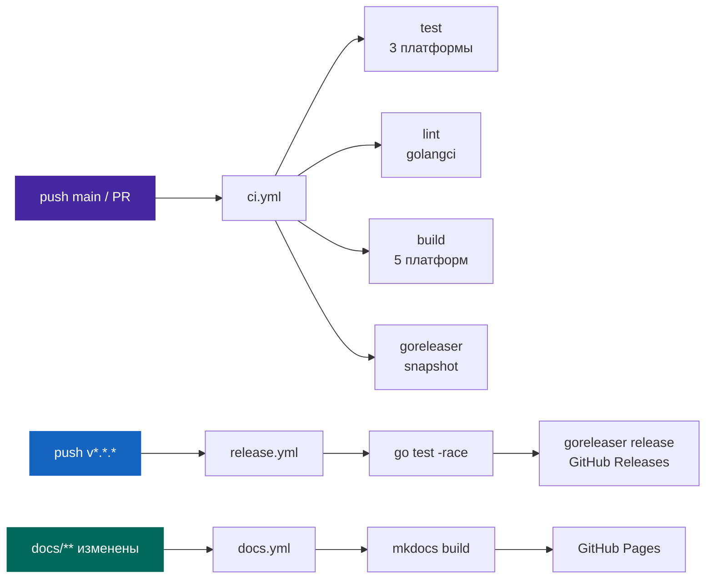

# CI/CD и релизы

## Обзор пайплайна



---

## CI Workflow (`.github/workflows/ci.yml`)

```yaml
name: CI

on:
  push:
    branches: [main]
    paths-ignore: ["**.md", "docs/**", ".gitignore"]
  pull_request:
    branches: [main]

env:
  # Убирает warning о Node.js 20 deprecation
  FORCE_JAVASCRIPT_ACTIONS_TO_NODE24: true

permissions:
  contents: read
```

### test — матрица платформ

```yaml
  test:
    strategy:
      matrix:
        include:
          - { os: ubuntu-latest, go: "1.22" }   # основная
          - { os: ubuntu-latest, go: "1.23" }   # новая версия Go
          - { os: macos-latest,  go: "1.22" }   # нативный macOS

    steps:
      - uses: actions/checkout@v4
      - uses: actions/setup-go@v5
        with:
          go-version: ${{ matrix.go }}
          cache: true
      - run: go mod download && go mod verify
      - run: go vet ./...
      - run: go test ./... -v -race -timeout 60s
```

!!! tip "Зачем macOS runner?"
    Кросс-компиляция darwin-бинарника с Ubuntu не гарантирует корректную работу
    на реальном Mac (отличия в syscall, stdio поведении). `macos-latest` runner
    запускает нативный Go код.

### build — кросс-компиляция 5 платформ

```yaml
  build:
    runs-on: ubuntu-latest
    strategy:
      matrix:
        include:
          - { goos: linux,   goarch: amd64 }
          - { goos: linux,   goarch: arm64 }
          - { goos: darwin,  goarch: amd64 }
          - { goos: darwin,  goarch: arm64 }
          - { goos: windows, goarch: amd64 }
    steps:
      - name: Build
        env:
          GOOS: ${{ matrix.goos }}
          GOARCH: ${{ matrix.goarch }}
          CGO_ENABLED: "0"  # статическая линковка
        run: |
          go build \
            -ldflags="-s -w -X main.version=ci-$(git rev-parse --short HEAD)" \
            -o bin/mcp-server-${{ matrix.goos }}-${{ matrix.goarch }} \
            ./cmd/server
```

---

## Release Workflow

```yaml title=".github/workflows/release.yml"
on:
  push:
    tags: ["v*.*.*"]
  workflow_dispatch:     # ручной запуск

permissions:
  contents: write        # создание GitHub Release

jobs:
  release:
    steps:
      - uses: actions/checkout@v4
        with:
          fetch-depth: 0  # goreleaser нужна полная история

      - run: go test ./... -race

      - uses: goreleaser/goreleaser-action@v6
        with:
          version: "~> v2"
          args: release --clean
        env:
          GITHUB_TOKEN: ${{ secrets.GITHUB_TOKEN }}
```

---

## Goreleaser (`.goreleaser.yml`)

=== "Сборки"

    ```yaml
    version: 2
    
    builds:
      - main: ./cmd/server
        binary: my-api-mcp
        env: [CGO_ENABLED=0]
        goos: [linux, darwin, windows]
        goarch: [amd64, arm64]
        ignore:
          - { goos: windows, goarch: arm64 }
        ldflags:
          - -s -w
          - -X main.version={{ .Version }}
          - -X main.commit={{ .ShortCommit }}
          - -X main.date={{ .Date }}
    ```

=== "Архивы (Intel/Silicon)"

    ```yaml
    archives:
      - formats: [tar.gz]       # НЕ format: (deprecated в v2)
        format_overrides:
          - { goos: windows, formats: [zip] }
        name_template: >-
          {{ .ProjectName }}_{{ .Version }}_
          {{- if and (eq .Os "darwin") (eq .Arch "amd64") }}darwin_amd64_intel
          {{- else if and (eq .Os "darwin") (eq .Arch "arm64") }}darwin_arm64_silicon
          {{- else }}{{ .Os }}_{{ .Arch }}
          {{- end }}
    ```
    
    Результат:
    ```
    my-api-mcp_1.0.0_linux_amd64.tar.gz
    my-api-mcp_1.0.0_darwin_amd64_intel.tar.gz     ← macOS Intel
    my-api-mcp_1.0.0_darwin_arm64_silicon.tar.gz   ← Apple Silicon
    my-api-mcp_1.0.0_windows_amd64.zip
    checksums.txt
    ```

=== "Changelog"

    ```yaml
    changelog:
      use: github
      groups:
        - { title: "🚀 New Features", regexp: '^.*?feat.*' }
        - { title: "🐛 Bug Fixes",    regexp: '^.*?fix.*' }
        - { title: "🔧 Improvements", regexp: '^.*?(refactor|chore|ci).*' }
      filters:
        exclude: ["^Merge ", "^chore(deps):", "typo"]
    ```

---

## Versioning и релизный процесс

### Semantic Versioning

| Тип | Когда | Команда |
|-----|-------|---------|
| `patch` | Bugfix, нет новых features | `make tag-patch` |
| `minor` | Новые tools, обратно совместимо | `make tag-minor` |
| `major` | Breaking changes | `make tag-major` |

### Процесс релиза

```bash
# 1. Прогнать тесты
go test ./... -race

# 2. Обновить CHANGELOG.md
#    [Unreleased] → [v1.1.0] — 2026-05-27

# 3. Закоммитить
git commit -am "chore: release v1.1.0"
git push origin main

# 4. Dry-run
goreleaser release --snapshot --clean
ls dist/  # проверить артефакты

# 5. Создать тег (интерактивно, с подтверждением)
make tag-minor

# 6. Следить за Actions
gh run watch
```

---

## Docs Workflow — GitHub Pages

Документация публикуется автоматически при изменениях в `docs/` или `mkdocs.yml`.

```yaml title=".github/workflows/docs.yml"
name: Deploy Docs to GitHub Pages

on:
  push:
    branches: [main]
    paths:
      - "docs/**"
      - "mkdocs.yml"
      - ".github/workflows/docs.yml"
  workflow_dispatch:

permissions:
  contents: read
  pages: write
  id-token: write

concurrency:
  group: "pages"
  cancel-in-progress: false  # не прерывать активный деплой

jobs:
  build:
    runs-on: ubuntu-latest
    steps:
      - uses: actions/checkout@v4
      - uses: actions/setup-python@v5
        with:
          python-version: '3.x'
      - run: pip install mkdocs-material mkdocs-minify-plugin
      - uses: actions/configure-pages@v5
      - run: mkdocs build --site-dir _site
      - uses: actions/upload-pages-artifact@v3
        with:
          path: _site

  deploy:
    environment:
      name: github-pages
      url: ${{ steps.deployment.outputs.page_url }}
    runs-on: ubuntu-latest
    needs: build
    steps:
      - id: deployment
        uses: actions/deploy-pages@v4
```

!!! warning "Обязательная настройка: Pages source"
    **Settings → Pages → Source** → выбрать **"GitHub Actions"** (не "Deploy from branch").
    
    Без этого деплой падает с ошибкой:
    ```
    Error: Pages deployment is disabled.
    ```

### Локальная разработка документации

```bash
# Установить инструменты (версии зафиксированы в docs/requirements.txt)
pip install -r docs/requirements.txt

# Live preview с hot reload
mkdocs serve
# → http://127.0.0.1:8000

# Сборка (проверить до push)
mkdocs build --strict
```

---

## GitHub Settings

Перед первым релизом настройте репозиторий:

!!! warning "Обязательно: Workflow permissions"
    **Settings → Actions → General → Workflow permissions:**
    Выбрать **"Read and write permissions"** — иначе goreleaser не сможет
    создавать GitHub Releases.

---

## Conventional Commits

| Prefix | Секция в Release Notes |
|--------|----------------------|
| `feat:` | 🚀 New Features |
| `fix:` | 🐛 Bug Fixes |
| `perf:` | ⚡ Performance |
| `refactor:`, `chore:`, `ci:` | 🔧 Improvements |
| `docs:` | 📖 Documentation |
| `test:` | (не попадает в changelog) |

```bash
git commit -m "feat: add myapi_search_users tool"
git commit -m "fix(transport): handle scanner buffer overflow"
git commit -m "feat!: rename all tools to v2 naming"  # breaking → major
```

---

## Golangci-lint (`.golangci.yml`)

```yaml
linters:
  enable:
    - gofmt
    - govet
    - errcheck
    - staticcheck
    - unused

linters-settings:
  gofmt:
    simplify: true  # эквивалент gofmt -s
```

!!! danger "gofmt -s, не просто gofmt!"
    CI использует `gofmt` с флагом `-s`. Ручное выравнивание полей структур
    пробелами вызывает ошибку линтера.
    
    ```bash
    # Правильно (как делает CI)
    gofmt -s -w .
    
    # Проверить (пустой вывод = OK)
    gofmt -s -l .
    ```
