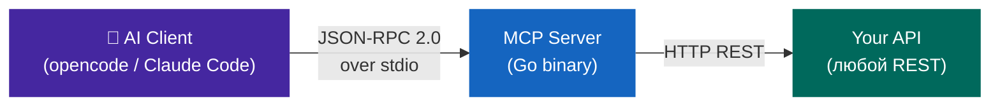

## Что вы построите

<div class="grid cards" markdown>

-   :fontawesome-brands-golang:{ .lg .middle } **Чистый Go**

    ---

    Никаких фреймворков — только stdlib + один пакет для `.env`.
    Статические бинарники без зависимостей от системы.

    [:octicons-arrow-right-24: Начать](overview.md)

-   :material-network:{ .lg .middle } **MCP Protocol**

    ---

    JSON-RPC 2.0 over stdio. Совместим с opencode, Claude Code
    и любым MCP-клиентом. Протокол `2025-11-25`.

    [:octicons-arrow-right-24: Протокол](protocol.md)

-   :material-tools:{ .lg .middle } **Tools за 4 шага**

    ---

    API метод → регистрация → handler → тест.
    Каждый новый инструмент занимает ~30 минут.

    [:octicons-arrow-right-24: Добавить tool](adding-tools.md)

-   :material-rocket-launch:{ .lg .middle } **Multi-platform CI/CD**

    ---

    GitHub Actions + goreleaser: Linux, macOS (Intel + Silicon),
    Windows. Автоматические релизы по тегу.

    [:octicons-arrow-right-24: CI/CD](cicd.md)

</div>

---

## Быстрый старт

=== "Создать проект"

    ```bash
    mkdir my-api-mcp && cd my-api-mcp
    git init
    export PATH="$HOME/.local/go/bin:$PATH"
    go mod init github.com/username/my-api-mcp
    go get github.com/joho/godotenv
    mkdir -p cmd/server internal/{mcp,myapi,config}
    ```

=== "Собрать и запустить"

    ```bash
    go build -o bin/mcp-server ./cmd/server
    ACCESS_TOKEN=your_token ./bin/mcp-server
    ```

=== "E2E тест"

    ```bash
    {
      printf '{"jsonrpc":"2.0","id":1,"method":"initialize",\
    "params":{"protocolVersion":"2025-11-25","capabilities":{},\
    "clientInfo":{"name":"test","version":"1"}}}\n'
      sleep 0.2
      printf '{"jsonrpc":"2.0","id":2,"method":"tools/list"}\n'
      sleep 0.3
    } | ACCESS_TOKEN=tok ./bin/mcp-server 2>/dev/null
    ```

=== "opencode config"

    ```jsonc
    // opencode.jsonc
    {
      "mcp": {
        "my-api": {
          "type": "local",
          "command": ["/absolute/path/to/bin/mcp-server"],
          "enabled": true,
          "env": { "ACCESS_TOKEN": "your_token" }
        }
      }
    }
    ```

---

## Как работает архитектура



**Поток вызова:**

```
User: "Покажи статистику за неделю"
  ↓ AI решает вызвать tool
tools/call myapi_get_report(date1=7daysAgo)
  ↓ MCP Server
GET https://api.example.com/report?date1=7daysAgo
  ↓ JSON данные
AI форматирует и отвечает пользователю
```

---

## Стек

| Слой | Технология |
|------|-----------|
| Протокол | MCP `2025-11-25`, JSON-RPC 2.0 |
| Транспорт | stdio (newline-delimited JSON) |
| Язык | Go 1.22+ |
| Зависимости | `github.com/joho/godotenv` (1 пакет) |
| CI | GitHub Actions (test × 3 ОС, lint, build × 5 платформ) |
| Релизы | goreleaser v2 |

> \* Один внешний пакет для загрузки `.env`. Всё остальное — стандартная библиотека Go.
