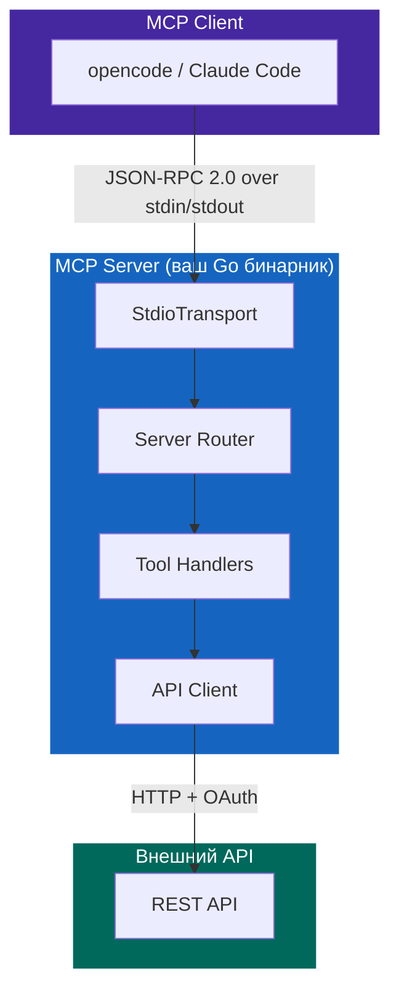
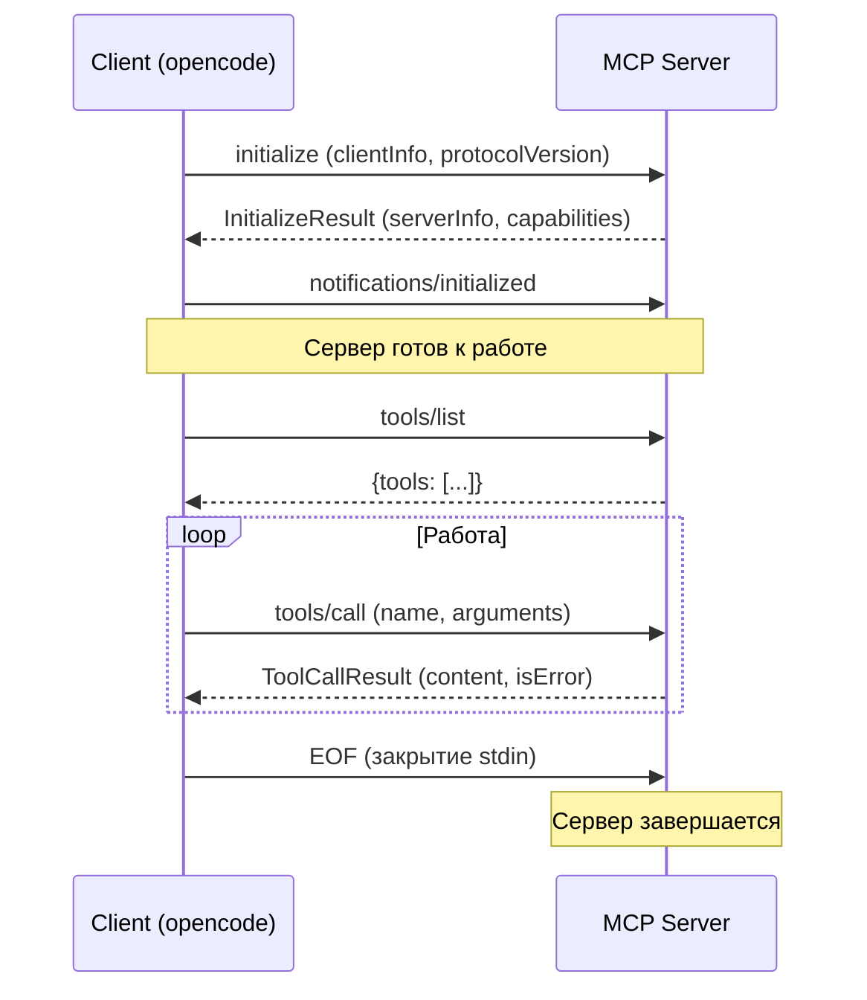

# Обзор и концепции

## Что такое MCP?

**MCP (Model Context Protocol)** — открытый протокол от Anthropic, стандартизирующий коммуникацию между AI-приложениями и внешними системами.



MCP сервер предоставляет **инструменты (tools)** — функции, которые AI-клиент может вызывать для получения данных или выполнения действий.

## Зачем это нужно?

Без MCP AI-помощник не может напрямую обращаться к вашим API. С MCP сервером вы даёте AI доступ к любым данным:

```
Пользователь: "Покажи топ-5 источников трафика за прошлую неделю"
       ↓
Claude вызывает: myapi_get_report(metrics=visits, date1=7daysAgo)
       ↓
MCP сервер делает HTTP запрос к вашему API
       ↓
Возвращает данные → Claude анализирует → Отвечает пользователю
```

## Транспорт: stdio JSON-RPC

MCP использует **stdio транспорт**: сервер читает из `stdin` и пишет в `stdout` JSON-RPC сообщения, разделённые переводом строки.

```
stdin  → {"jsonrpc":"2.0","id":1,"method":"tools/call",...}\n → сервер
stdout ← {"jsonrpc":"2.0","id":1,"result":{...}}\n           ← сервер
stderr → логи (только сюда! stdout зарезервирован для протокола)
```

!!! danger "Критически важно"
    Любой вывод не-JSON в `stdout` сломает протокол. Все логи — **только в `stderr`** или файл.
    Даже одна строка `fmt.Println("debug")` убьёт соединение.

## Lifecycle соединения



## Структура JSON-RPC сообщений

=== "Request"

    ```json
    {
      "jsonrpc": "2.0",
      "id": 1,
      "method": "tools/call",
      "params": {
        "name": "myapi_get_users",
        "arguments": {"limit": "10"}
      }
    }
    ```

=== "Success Response"

    ```json
    {
      "jsonrpc": "2.0",
      "id": 1,
      "result": {
        "content": [{"type": "text", "text": "[{\"id\": 1, ...}]"}],
        "isError": false
      }
    }
    ```

=== "Tool Error"

    ```json
    {
      "jsonrpc": "2.0",
      "id": 1,
      "result": {
        "content": [{"type": "text", "text": "User not found: HTTP 404"}],
        "isError": true
      }
    }
    ```

=== "Protocol Error"

    ```json
    {
      "jsonrpc": "2.0",
      "id": 1,
      "error": {
        "code": -32601,
        "message": "method not found: unknown/method"
      }
    }
    ```

=== "Notification (no id)"

    ```json
    {
      "jsonrpc": "2.0",
      "method": "notifications/initialized"
    }
    ```

## Два вида ошибок

Ключевое различие MCP, которое часто путают:

| Тип | Когда | Поле в ответе |
|-----|-------|--------------|
| **Протокольная** | Неверный JSON, неизвестный метод | `error.code` |
| **Tool error** | API вернул ошибку, неверные параметры | `result.isError: true` |

```
HTTP 404 от API
  ↓ client.get() → fmt.Errorf("HTTP 404 from /users/999: not found")
  ↓ GetUser() → fmt.Errorf("GetUser 999: %w", err)
  ↓ toolGetUser() → errorContent("Ошибка: GetUser 999: HTTP 404...")
  ↓ handleToolsCall() → okResponse(id, result)  ← НЕ errorResponse!
  ↓ {"result": {"content": [...], "isError": true}}
```

!!! tip "Правило"
    API ошибки → `result.isError: true`. Только протокольные сбои (плохой JSON, неизвестный метод) → поле `error`.

## Версия протокола

Используем **`2024-11-05`** — стабильная версия, поддерживаемая opencode и Claude Code.

Сервер всегда отвечает этой же версией в `initialize`, независимо от запроса клиента.
