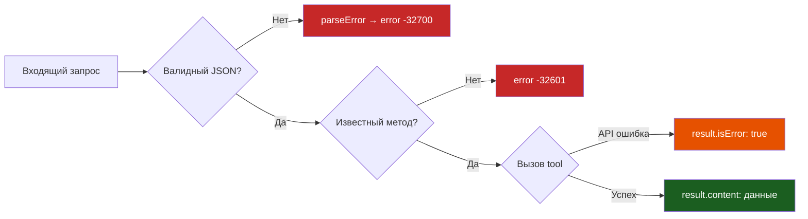

# Протокол и транспорт

## Типы JSON-RPC (`internal/mcp/types.go`)

Этот файл одинаков для любого MCP сервера — копируйте as-is.

```go title="internal/mcp/types.go"
package mcp

import "encoding/json"

// ─── JSON-RPC 2.0 ─────────────────────────────────────────────────────────────

// Request — входящее сообщение (запрос или уведомление).
// Уведомления имеют ID == nil.
type Request struct {
    JSONRPC string           `json:"jsonrpc"`
    ID      *json.RawMessage `json:"id,omitempty"`
    Method  string           `json:"method"`
    Params  json.RawMessage  `json:"params,omitempty"`
}

// Response — исходящий ответ.
type Response struct {
    JSONRPC string           `json:"jsonrpc"`
    ID      *json.RawMessage `json:"id"`
    Result  any              `json:"result,omitempty"`
    Error   *RPCError        `json:"error,omitempty"`
}

// RPCError — объект ошибки JSON-RPC 2.0.
type RPCError struct {
    Code    int    `json:"code"`
    Message string `json:"message"`
    Data    any    `json:"data,omitempty"`
}

const (
    CodeParseError     = -32700  // невалидный JSON
    CodeInvalidRequest = -32600  // нарушена структура JSON-RPC
    CodeMethodNotFound = -32601  // неизвестный метод
    CodeInvalidParams  = -32602  // неверные параметры
    CodeInternalError  = -32603  // внутренняя ошибка сервера
)

func okResponse(id *json.RawMessage, result any) Response {
    return Response{JSONRPC: "2.0", ID: id, Result: result}
}

func errorResponse(id *json.RawMessage, code int, msg string) Response {
    return Response{JSONRPC: "2.0", ID: id, Error: &RPCError{Code: code, Message: msg}}
}
```

### Почему `*json.RawMessage` для ID?

ID в JSON-RPC может быть строкой, числом или `null`. `*json.RawMessage` позволяет:

1. Передать ID клиенту обратно **без изменений**
2. Различить `null` (явный null) и отсутствие поля (уведомление)

### MCP-специфичные типы

```go
// Результат вызова инструмента
type ToolCallResult struct {
    Content []ContentItem `json:"content"`
    IsError bool          `json:"isError,omitempty"`
}

// Единица контента
type ContentItem struct {
    Type string `json:"type"` // "text" | "image" | "resource"
    Text string `json:"text,omitempty"`
}

// JSON Schema для входных параметров
type InputSchema struct {
    Type       string              `json:"type"` // всегда "object"
    Properties map[string]Property `json:"properties"`
    Required   []string            `json:"required,omitempty"`
}

type Property struct {
    Type        string   `json:"type"`
    Description string   `json:"description"`
    Enum        []string `json:"enum,omitempty"`
    Default     any      `json:"default,omitempty"`
}
```

---

## Транспорт (`internal/mcp/transport.go`)

Тонкий слой между stdio и JSON-RPC. Одинаков для любого MCP сервера.

```go title="internal/mcp/transport.go"
package mcp

import (
    "bufio"
    "encoding/json"
    "fmt"
    "io"
    "sync"
)

type StdioTransport struct {
    scanner *bufio.Scanner
    encoder *json.Encoder
    mu      sync.Mutex  // защита encoder от конкурентной записи
}

func NewStdioTransport(r io.Reader, w io.Writer) *StdioTransport {
    scanner := bufio.NewScanner(r)

    // 4 MB буфер — нужен для больших ответов API
    // По умолчанию Scanner имеет 64 KB — этого мало
    const maxTokenSize = 4 * 1024 * 1024
    scanner.Buffer(make([]byte, maxTokenSize), maxTokenSize)

    return &StdioTransport{
        scanner: scanner,
        encoder: json.NewEncoder(w),
    }
}

func (t *StdioTransport) ReadRequest() (*Request, error) {
    if !t.scanner.Scan() {
        if err := t.scanner.Err(); err != nil {
            return nil, fmt.Errorf("stdin read: %w", err)
        }
        return nil, io.EOF  // нормальное завершение
    }

    var req Request
    if err := json.Unmarshal(t.scanner.Bytes(), &req); err != nil {
        return nil, &parseError{raw: t.scanner.Text(), err: err}
    }
    if req.JSONRPC != "2.0" {
        return nil, &invalidRequestError{msg: `jsonrpc must be "2.0"`}
    }
    return &req, nil
}

func (t *StdioTransport) WriteResponse(resp Response) error {
    t.mu.Lock()
    defer t.mu.Unlock()
    return t.encoder.Encode(resp)  // Encode добавляет \n автоматически
}
```

!!! info "Размер буфера: почему 4 MB?"
    По умолчанию `bufio.Scanner` имеет буфер **64 KB**. Этого мало для:
    
    - Больших ответов API с тысячами записей
    - Logs API (TSV данные могут быть мегабайтами)
    - Списков с деталями по каждому объекту
    
    Симптом превышения: `bufio.Scanner: token too long`

---

## Protocol vs Tool errors


